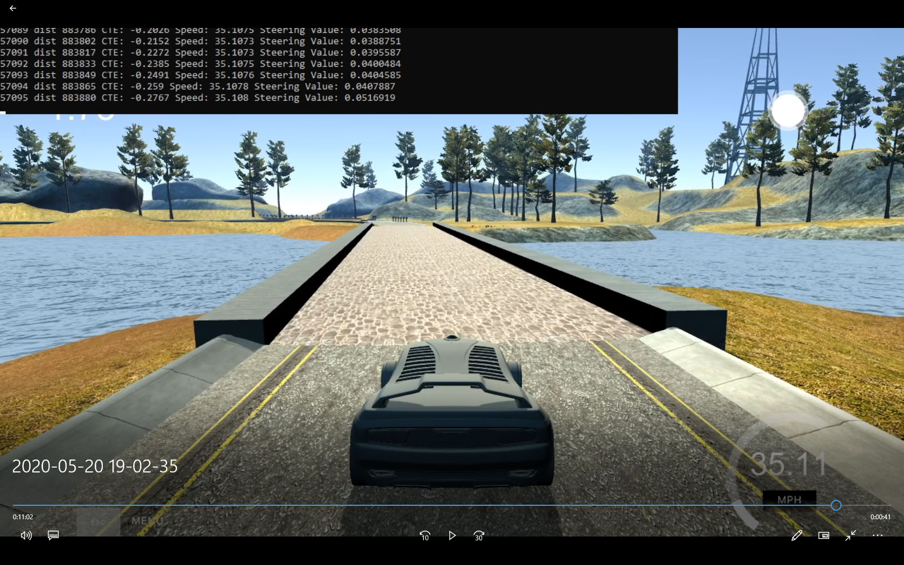
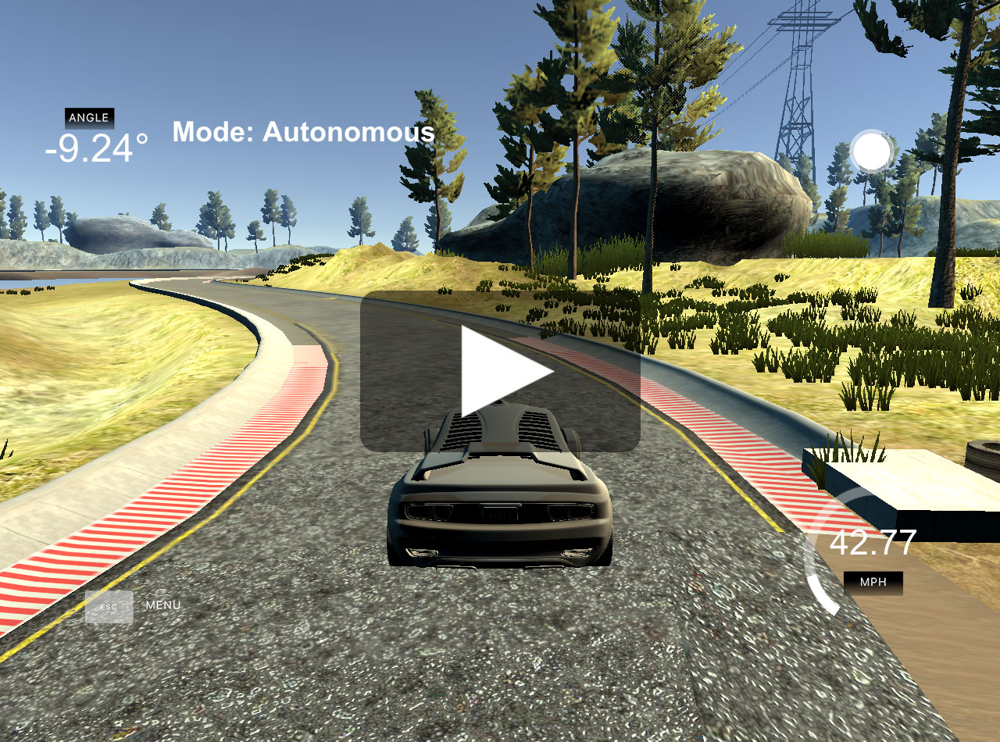

# CarND-Controls-PID
Self-Driving Car Engineer Nanodegree Program

---
## Goal of the project

In a simulator, the car is guided around the race track as fast as possible, using a PID controller.
The input is speed measurement, and Cross Track Error, or CTE for short, which is the distance to the center of the road.
Output is the steering angle and throttle.

## Manual tuning

The first step was to manually tune the `Kp`, `Ki` and `Kd` values for the PID controller, which are the multipliers for the CTE, CTE integral and CTE derive.
The CTE is a distance metric, so translating it to steering requires dividing it with speed.
The constant in the arithmetic doesn't matter, as the PID parameters would be tuned anyway.
I've choosen to multiply it by 10 and divide it by speed, mostly because I thought speed was in m/s instead of mph, and then I was stuck with it.
The Ki value is a fine tuning parameters, because PD controller could not overcome a constant offset of CTE, but at this stage, this was not a concern.
After a few tries I came up with (0.2, 0, 1), which could go through the bridge, but then went straight, so I doubled all parameters to steer more strongly.

(0.4, 0, 2) was better, but oscillated a lot, so I doubled the Kd value to (0.4, 0, 4). This was the first set of constants that went through the track!

## Track measurement

The car is now doing indentical laps, so I do some measurements, like track length, update frequency, and possible skipped update steps.
For automatic tuning, I needed a stable environment, a few skipped error values could offset the integral CTE and ruin the `Ki` value optimization.
I created a video overlaying the update count and summed speed value (without multiplying by time) as distance, and used the bridge as a reference line.

Here's a reference frame:



I wrote down the values, and calculated the differences:
```
a=[ [30860,474731],
	[33743,519683],
	[36663,565224],
	[39587,610821],
	[42504,656330],
	[45422,701827],
	[48339,747324],
	[51261,792895],
	[54166,838188],
	[57095,883880]]

for i in range(len(a)-1): print(a[i+1][0]-a[i][0], a[i+1][1]-a[i][1])

2883 44952
2920 45541
2924 45597
2917 45509
2918 45497
2917 45497
2922 45571
2905 45293
2929 45692
```
The first measurement was off, but the rest was consisent. From the video timestamp, the 9 laps took 662 seconds, so 73.5 seconds each.
2919 frames per lap means around 39.69 Hz refresh rate. The track is (883880-519683)/8/39.69=1147 meters long.

## Automatic tuning

The twiddle algorithm was running for a small portion of the track for 20 iteration to get better starting values faster: `0.61, 0.003, 10.105`
The result time was actually worse than my manual tuning by 10 seconds. After 333 the time got even worse: about 92 seconds.
I wasn't satisfied with the new parameters, which were `(1.22200785, 0.00786800, 29.69043041)`.
The steering was too strong, similar to manual keyboard control.

I tried to optimize to time instead. It got better results for a while, but it was dangerously close to the side of the road, and at one point, it (got stuck)[stuck.jpg].
My auto-recovery algorithm was set to 5 meters, so it didn't detect this. Maybe it would be a good fine-tuning method to optimize for speed, but at this point, it's just too random.

It also turned out that the update freqency changes if I change the detail level in the simulator, and I can't measure distance from frames and speed only.
The error calculation simply summed all the CTE square values, so that if there were fewer frames, it meant the car was faster, and added fewer error values to further decrease the sum.
I kept this logic, multiplied the CTE square value by delta time.

### Speed control

To improve further, I changed the speed control to the same logic I used in the Behavior Cloning project, which depends on the angle, and instead of PID, there're 2 breakpoints at speed*0.8 and speed*1.2.
The maximum speed was increased to 50 mph, and it turned out that my manual tuned parameters for quick driving couldn't complete lap, whereas the twiddle-optimized values succeded.

The next step was to implement the speed control as a PID controller. I choose theinitial values to (0.1, 0, 0.1), based on the linear method above, which was fine.
At 30 mph target the maximum speed was only 27.6.
The integral component could solve this issue, but there were lot of error at the start of the lap, so instead of fine tuning it, I just used the PD controller with higher target speed.

After 70 more iteration, the lap time went under 1 minute. There were very little improvement after this. The paramters at this point are: `(1.01061975, 0.01408510, 23.62485219)`, and the current delta values for twiddle: `(0.05156567,0.00421901,0.63024704)`

With these values, I increased the maximum speed to 100 mph, and the car was able to do a full lap in 50.2 seconds.
Further optimization was not possible with these settings, because at this speed, the car went offroad and got stuck on the curb, so I halved the delta values.
The total error did not get better, but I was able find parameters with lower lap time: `0.98061975, 0.01408510, 23.62485219`

## Result

Switching off the twiddle optimization and going around in laps was not safe at 100 mph, at the second lap the car got stuck on the curb. I lowered the maximum speed to 80 mph, the first lap was 57.55 second, the next laps were around 50 seconds.

In the end, the driving was smooth for most of the track, as shown in this video:

[](https://www.youtube.com/watch?v=HrXEVHvQLAI)

